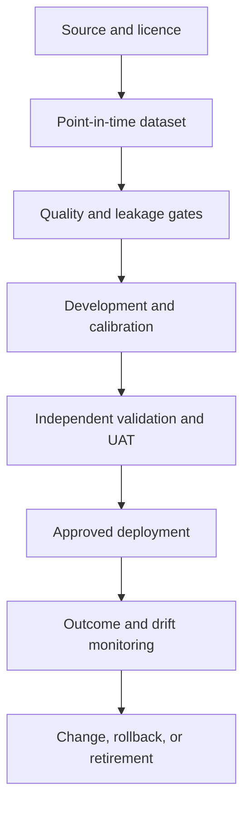

# Chapter 4 - Mathematical and operational foundations

## The problem is a cash-flow distribution, not a label

A default flag is useful, but the economic object is the uncertain stream of contractual payments, drawdowns, recoveries, costs, collateral proceeds, and prepayments. A borrower with a high probability of default but low exposure may create less expected loss than a low-PD borrower with a very large undrawn commitment. A classifier therefore becomes useful only after its output is connected to exposure, loss severity, time, pricing, capital, and policy.

For a single exposure and a fixed horizon, the familiar conditional expected-loss expression is

\[
EL = PD \times LGD \times EAD.
\]

If the components are random and dependent, the portfolio expectation is instead

\[
\mathbb{E}[L] = \mathbb{E}[D \times LGD \times EAD],
\]

where \(D\) is the default indicator. Replacing this expectation with the product of three unconditional averages silently assumes away relevant dependence. Downturns can raise default frequency, reduce collateral values, increase workout time and cost, and induce borrowers to draw committed lines. Later chapters model these connections explicitly.

### Worked calculation

Suppose a performing loan has a 12-month PD of 3%, an LGD of 40%, and EAD of EUR 50,000. The one-year expected loss is

\[
0.03 \times 0.40 \times 50{,}000 = EUR\ 600.
\]

This is an expectation, not a prediction that the account will lose EUR 600. With a binary default event, most otherwise identical accounts produce no default loss during the year while a minority produce much larger losses. Pricing and capital decisions must therefore consider both the expected value and the shape of the loss distribution.

## Four statistical formulations

| Question | Unit and target | Typical model | Credit-risk use |
|---|---|---|---|
| Will default occur within 12 months? | Application or account; binary target | Logistic regression, trees, boosting | Application or behavioural PD |
| How much will be lost if default occurs? | Default episode; bounded or mixed target | Fractional, beta, two-stage, mixture model | Workout LGD |
| When will default, cure, or prepayment occur? | Exposure-period panel; censored event time | Cox, AFT, discrete hazard, competing risks | Lifetime PD and recovery |
| What action changes the outcome? | Eligible decision point; potential outcomes | Causal model, uplift, off-policy evaluation | Collections and limit strategies |

The first three are predictive. The fourth is causal. A model that accurately predicts which customers will cure does not prove that a proposed treatment caused the cure.

## Dataset formulation comes before the algorithm

Every example must state:

- the unit of observation;
- the as-of date;
- the observation window used to construct predictors;
- the performance window used to construct the target;
- the operational definition of default;
- the treatment of prepayment, closure, cure, restructuring, and incomplete outcomes;
- the population included and excluded;
- when each variable became available.

Without these definitions, an AUC is not reproducible and may be meaningless. For example, using a delinquency field measured after the 12-month performance window creates target leakage even if the code executes correctly.

## A first probability-of-default model

The repository baseline uses logistic regression because its predicted value is naturally bounded between zero and one:

\[
PD(\mathbf{x}) = \frac{1}{1 + \exp[-(\beta_0 + \mathbf{x}^{\top}\boldsymbol{\beta})]}.
\]

Categorical features are one-hot encoded and numeric features are standardised inside a single fitted pipeline. The model is intentionally unweighted: class weights can improve a classification objective but often alter probability calibration. Imbalance is handled through probability, ranking, cost, and calibration evaluation rather than treating accuracy as the central metric.

Run the baseline on an out-of-time synthetic sample:

```bash
creditrisk-demo --dataset synthetic_retail --rows 5000
```

Then switch the same workflow to South German Credit:

```bash
creditrisk-demo --dataset uci_south_german
```

Because South German Credit has no application dates, the loader labels its split as `stratified_random_no_time_available`. The limitation is preserved in the run manifest rather than hidden.

The implementation is in `src/creditriskbook/models/pd.py`. Tests require valid probabilities, both target classes, a real out-of-time ordering when dates exist, and minimum synthetic discrimination. These tests verify software behaviour; they do not validate a model for lending.

## From a model to a controlled system

A fitted estimator is one component of a controlled process:



The rest of the book builds the missing controls. A model cannot approve its own data, validation, deployment, or redevelopment. Agentic AI does not remove that separation of duties.

## Exercises

1. Calculate expected loss for three exposures with the same PD but different LGD and EAD. Explain why a rank-order PD model alone cannot rank expected monetary loss.
2. Run the synthetic and South German datasets through the same command. Compare split strategy, sample size, default rate, AUC, Brier score, and limitations.
3. Add `days_past_due_after_12m` to the model features and explain why the improved performance would be invalid.
4. Change the synthetic macroeconomic path and test whether the out-of-time calibration changes before retraining.

## Sources

- Basel Committee, [CRE30 - IRB overview and asset class definitions](https://www.bis.org/basel_framework/chapter/CRE/30.htm).
- Basel Committee, [CRE32 - IRB risk components](https://www.bis.org/basel_framework/chapter/CRE/32.htm).
- IFRS Foundation, [IFRS 9 project summary](https://www.ifrs.org/content/dam/ifrs/project/fi-impairment/ifrs-standard/published-documents/project-summary-july-2014.pdf).

