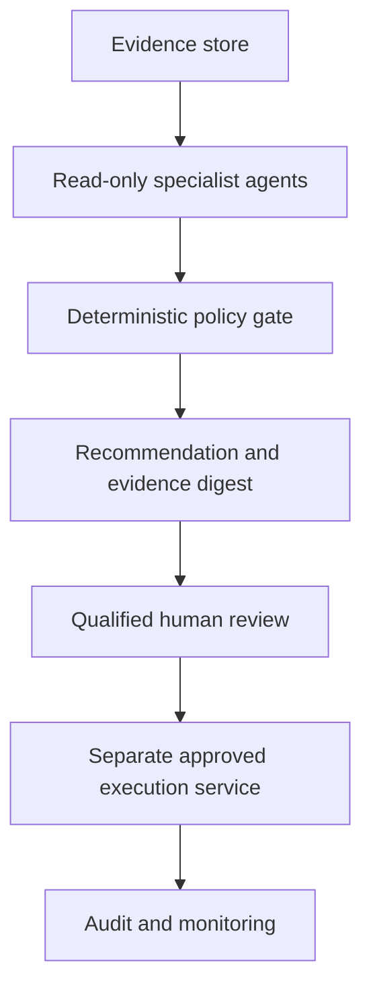

# Chapter 70 - A governed agentic-AI architecture for credit risk

## Autonomy must be defined as authority, not marketing

An agent is not safe merely because it explains its output or calls several tools. In a credit institution, the important question is what the component can observe, change, approve, and communicate. A useful monitoring agent can gather evidence and recommend escalation without receiving the authority to approve customers, waive controls, retrain a model, or deploy code.

The reference implementation begins with deterministic policies and an immutable evidence digest. Language-model reasoning can later assist with summarisation and investigation planning, but it is not placed between a customer and a binding credit decision.

## Regulatory boundary

The EU AI Act identifies AI systems used to evaluate the creditworthiness or credit score of natural persons as high-risk, subject to its scope and exceptions. The Act treats prudential internal models used to calculate capital requirements differently. This distinction matters: an application-decision agent, an IFRS 9 documentation assistant, and an IRB monitoring agent can have different legal and model-risk classifications even when they share software components.

The book applies a stricter engineering default: every agent that can influence a model or policy is inventoried, tested, logged, and assigned an owner. Customer-impacting actions require explicit approved workflows and jurisdictional review.

## Reference architecture

Read-only specialist agents can cover:

- data-quality and reconciliation evidence;
- point-in-time lineage and leakage checks;
- model performance, calibration, drift, and fairness;
- IFRS 9 staging/ECL reconciliation;
- IRB parameter and capital-impact monitoring;
- documentation completeness and source citation;
- incident triage and proposed next tests.

The execution service is separate. A recommendation cannot silently become an action.

## Implemented foundation agent

`GovernedMonitoringAgent` accepts a structured `QualityReport` and monitoring metrics. Its policy is intentionally inspectable:

- critical data-quality failure -> `HALT`;
- prediction PSI at or above 0.25 -> `ESCALATE`;
- matured-outcome AUC below 0.60 -> `ESCALATE`;
- PSI at or above 0.10 -> `REVIEW`;
- otherwise -> `CONTINUE_MONITORING`.

These values are teaching defaults, not universal regulatory thresholds. A real institution must approve definitions, windows, segments, materiality, and actions. The agent always sets `human_approval_required=True` and records prohibited actions including customer approval, decline, price/limit changes, and unapproved retraining or deployment.

The input evidence is canonicalised and hashed with SHA-256. This shows which evidence produced the recommendation. It does not by itself prove that the upstream evidence is correct; source authentication and access controls remain necessary.

## Why the attached paper is not used as performance evidence

The supplied paper *Agentic AI for Autonomous, Explainable, and Real-Time Credit Risk Decision-Making* is useful for discussing a proposed multi-agent direction, but its reported numerical results are not reproducible from the paper. The PDF states a December 2024 publication date while citing many 2025 sources, describes an unspecified loan-applicant dataset, and reports Excel-created comparisons without enough experimental detail. The book will not repeat its accuracy or latency claims as established findings.

This evidence review illustrates a broader rule: an agentic architecture diagram is not a validation. Claims require data lineage, baselines, temporal evaluation, uncertainty, latency measurement conditions, failure tests, and reproducible code.

## Threats and controls

| Threat | Credit-risk example | Minimum control |
|---|---|---|
| Hallucination | Invented regulatory requirement or dataset licence | Retrieval from approved sources, citation verification, fail closed |
| Prompt injection | Text field instructs an agent to export data or ignore policy | Treat customer text as data, isolate tools, allow-list actions |
| Excess authority | Monitoring agent redeploys a challenger | Read-only tools and separate human-approved execution |
| Data leakage | Personally identifiable or confidential data enters an external model | Data classification, minimisation, approved environment, logging |
| Unstable reasoning | Same evidence produces materially different action | Deterministic policy gate, fixed evaluations, bounded output schema |
| Biased recommendation | Agent focuses only on aggregate performance | Segment and fairness evidence, challenge and override review |
| Evidence tampering | Agent rewrites a failed report | Immutable source artefacts, digests, access controls, independent audit |

## Evaluation before any expansion of authority

Agent tests include:

1. correct escalation for every policy boundary;
2. refusal of prohibited tools and actions;
3. adversarial and prompt-injection cases;
4. missing, contradictory, stale, and manipulated evidence;
5. deterministic replay of the same evidence;
6. evidence citation and digest verification;
7. false-positive and false-negative escalation costs;
8. human override, stop, rollback, and incident procedures;
9. evaluation by portfolio, segment, jurisdiction, and regime;
10. monitoring of the agent itself after deployment.

Language quality is secondary to control effectiveness. An eloquent recommendation with weak evidence is a failure.

## Sources

- European Union, [Regulation (EU) 2024/1689 - Artificial Intelligence Act](https://eur-lex.europa.eu/eli/reg/2024/1689/oj/eng).
- NIST, [Artificial Intelligence Risk Management Framework](https://www.nist.gov/itl/ai-risk-management-framework).
- Federal Reserve, [Supervisory Guidance on Model Risk Management](https://www.federalreserve.gov/frrs/guidance/supervisory-guidance-on-model-risk-management.htm).
- EBA, [Guidelines on loan origination and monitoring](https://www.eba.europa.eu/activities/single-rulebook/regulatory-activities/credit-risk/guidelines-loan-origination-and-monitoring).

